# Stock Market Kafka Real Time Data Engineering Project

## Introduction 
In this project, you will execute an End-To-End Project on Real-Time Stock Market Data using Kafka.

We are going to use different technologies such as **Python**, **Amazon Web Services (AWS)**, **Apache Kafka**, **Glue**, **Athena**, and **SQL**.

## Architecture 
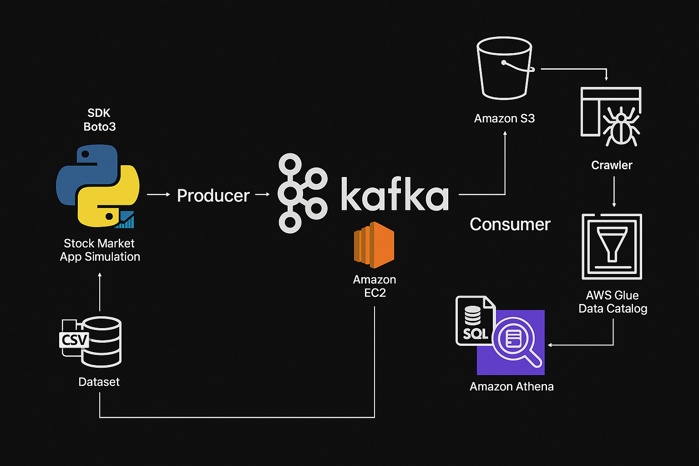

## Technology Used

- **Programming Language**: **Python**

- **Amazon Web Services (AWS)**:
  1. **S3 (Simple Storage Service)**
  2. **Athena**
  3. **Glue Crawler**
  4. **Glue Catalog**
  5. **EC2**

- **Apache Kafka**

## Step 1: Setting Up EC2 Instance

- Launch an **Amazon EC2** instance using the **t2.large** instance type (Amazon Linux 2).
- Configure the **security group**:
  - Allow **All traffic** (inbound and outbound) — for development/testing purposes only.
  - Make sure port `22` (SSH) is open so you can connect.

 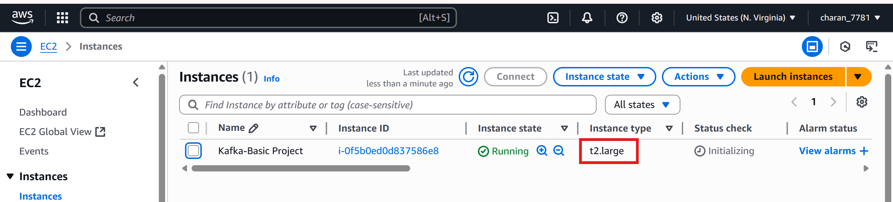

## Step 2: Download and Extract Kafka

- Download the Kafka binary from [Apache Kafka Downloads](https://downloads.apache.org/kafka/):
  ```bash
  wget https://downloads.apache.org/kafka/3.7.2/kafka_2.12-3.7.2.tgz
  tar -xvf kafka_2.12-3.7.2.tgz
  ```

 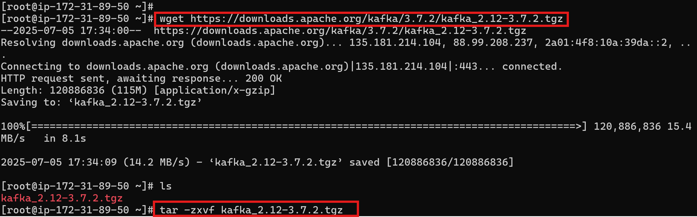

## Step 3: Install Java

Kafka requires Java to run. Use the following commands to install and verify Java on your EC2 instance:

```bash
# Check if Java is already installed
java -version

# Install OpenJDK 1.8
sudo yum install java-1.8.0-openjdk -y

# Verify Java installation
java -version
```

## Step 4: Configure Kafka to Use EC2 Public IP

Before starting **Zookeeper** or **Kafka**, make sure Kafka is not binding to the default private IP.

- Edit the `server.properties` file to point Kafka to your EC2 **public IP**:    

```bash
cd kafka_2.12-3.7.2
vi config/server.properties
```

Find and uncomment or add the following line:

```properties
advertised.listeners=PLAINTEXT://<your-ec2-public-ip>:9092  # Add your public IP at <your-ec2-public-ip>
```

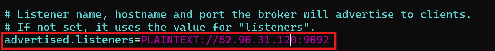


## Step 5: Start Zookeeper

Kafka requires **Zookeeper** to coordinate distributed brokers.

- Make sure you're inside the extracted **Kafka directory**.

- Start the Zookeeper server:
```bash
bin/zookeeper-server-start.sh config/zookeeper.properties
```

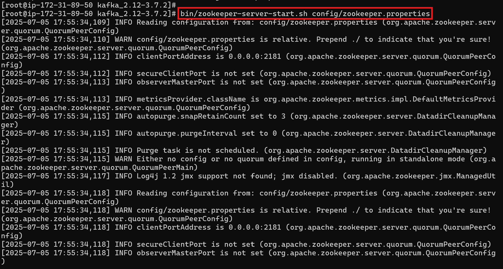

## Step 6: Start Kafka Server

- Open **another terminal** and SSH into the EC2 instance again:
```bash
ssh -i <your-key.pem> ec2-user@<your-ec2-public-ip>
```

This sets the maximum (-Xmx) and minimum (-Xms) heap memory allocated to the Kafka JVM.
It's helpful on low-memory machines (like t2.large) to avoid excessive resource usage.

```bash
export KAFKA_HEAP_OPTS="-Xmx256M -Xms128M"
cd kafka_2.12-3.7.2
bin/kafka-server-start.sh config/server.properties
```
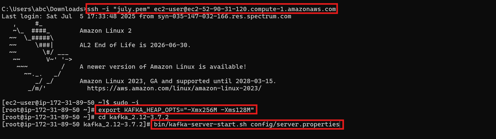


## Step 7: Create a Kafka Topic

- Open **another terminal window** and SSH into your EC2 instance again.

- Navigate to the Kafka directory:
```bash
cd kafka_2.12-3.7.2
bin/kafka-topics.sh --create --topic demo_test --bootstrap-server <your-ec2-public-ip>:9092 --replication-factor 1 --partitions 1
# Replace <your-ec2-public-ip> with your instance public Ip
```

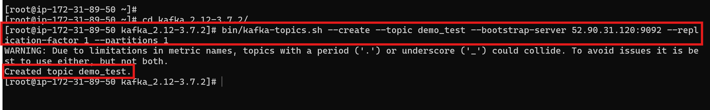

## Step 8: Start Kafka Producer

In the **same terminal** where you created the topic:

- Start the Kafka console producer:
```bash
bin/kafka-console-producer.sh --topic demo_test --bootstrap-server <your-ec2-public-ip>:9092
# Replace <your-ec2-public-ip> with your instance public Ip
```
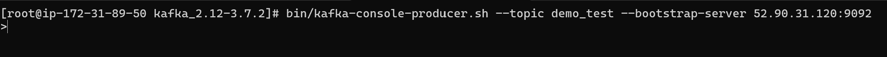


## Step 9: Start Kafka Consumer

- Open a **new terminal** and SSH into your EC2 instance again.
- Navigate to the Kafka directory:

```bash
cd kafka_2.12-3.7.2
bin/kafka-console-consumer.sh --topic demo_test --bootstrap-server <your-ec2-public-ip>:9092
# Replace <your-ec2-public-ip> with your instance public Ip
```

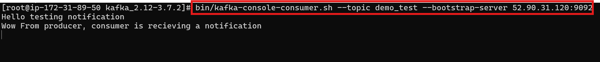

## ✅ Step 10: Verify Producer-Consumer Communication

- Type a few test messages in the **producer terminal**.
- You should see those same messages appear instantly in the **consumer terminal**.

> This confirms that the Kafka broker, topic, producer, and consumer are all working correctly.

### Sample Output:

| Producer Terminal                                   | Consumer Terminal                                   |
|-----------------------------------------------------|-----------------------------------------------------|
| Hello testing notification                          | Hello testing notification                          |
| Wow From producer, consumer is receiving a notification | Wow From producer, consumer is receiving a notification |

🖼️ *Below is a screenshot of the working setup:*

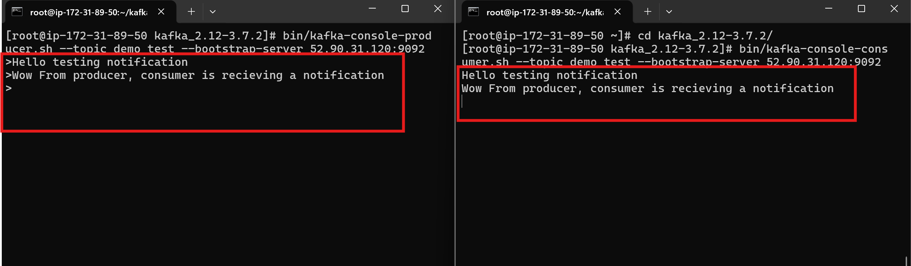

## Step 11: Set Up Jupyter Notebook for Kafka Automation

- Launch Jupyter Notebook on your local machine or a server:
```bash
jupyter notebook
```
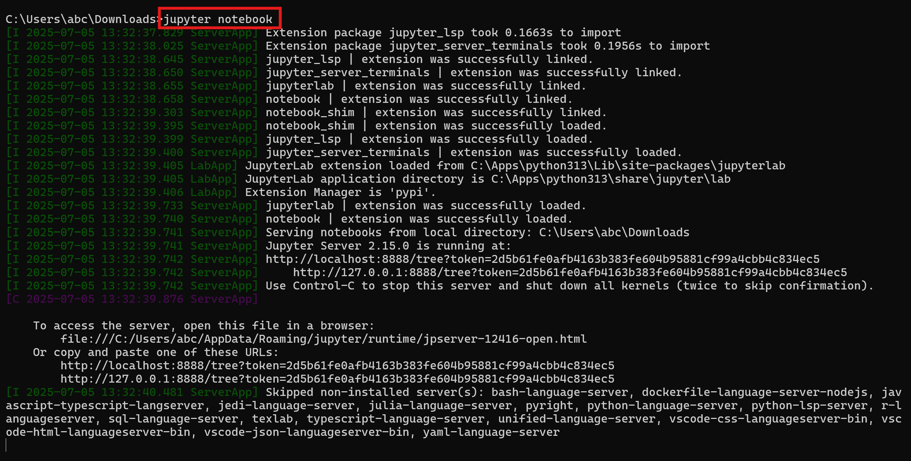

Create two new Jupyter notebooks for automating Kafka operations using Python:

- **KafkaProducer.ipynb** — Simulates a Kafka producer that reads data from a CSV file and sends each record to a Kafka topic.

- **KafkaConsumer.ipynb** — Consumes messages from the Kafka topic and performs actions such as storing the data in Amazon S3.

> 🧠 These notebooks serve as the foundation for building a real-time streaming pipeline using Python and Kafka.

## Step 12: Import Required Python Libraries

In your Jupyter notebooks, start by importing the required libraries.

### KafkaProducer.ipynb

```python
import pandas as pd
from kafka import KafkaProducer
from time import sleep
from json import dumps
import json
```
### KafkaConsumer.ipynb
```python
from kafka import KafkaConsumer
from time import sleep
from json import dumps, loads
import json
from s3fs import S3FileSystem
```

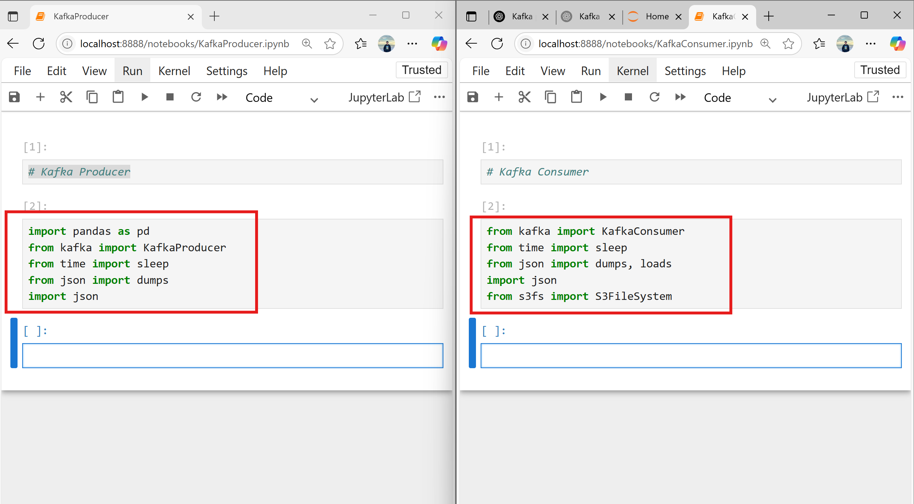

### Connect to Kafka (Producer Side)

In your `KafkaProducer.ipynb`, initialize the Kafka producer as shown:

```python
producer = KafkaProducer(
    bootstrap_servers=['<your-ec2-public-ip>:9092'],  # Replace with your EC2 IP
    value_serializer=lambda x: dumps(x).encode('utf-8')
)
```

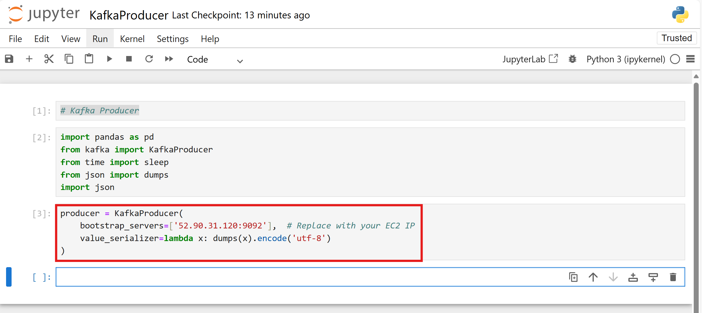

### Connect to Kafka (Consumer Side)

In your `KafkaConsumer.ipynb`, initialize the Kafka consumer:

```python
consumer = KafkaConsumer(
    'demo_test',
    bootstrap_servers=['<your-ec2-public-ip>:9092'],  # Replace with your EC2 IP
    value_deserializer=lambda x: loads(x.decode('utf-8'))
)
```
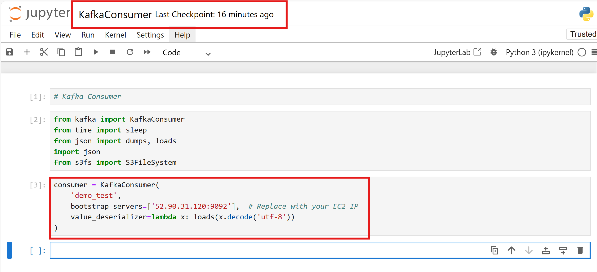

## Step 14: Create an S3 Bucket

Before consuming and storing Kafka data, create an **Amazon S3 bucket** to hold the JSON files.

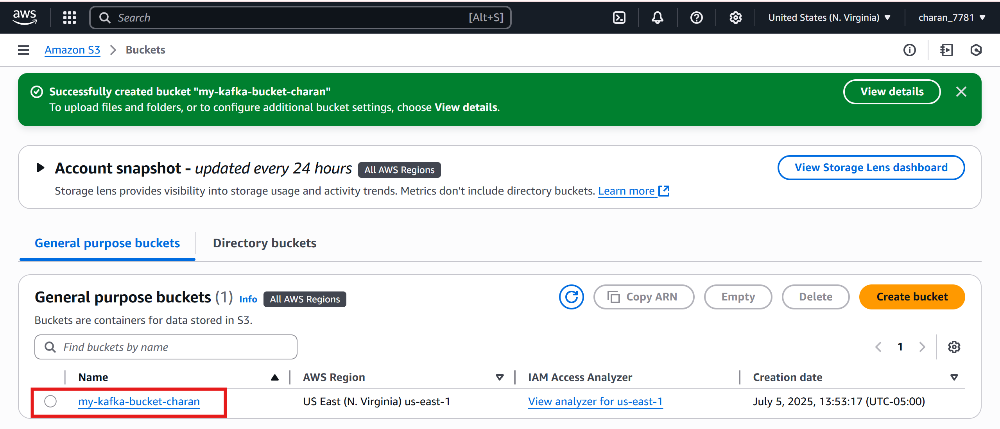

## Dataset Used
You can use any dataset, we are mainly interested in operation side of Data Engineering (building data pipeline) 

Here is the dataset used in the video - https://github.com/darshilparmar/stock-market-kafka-data-engineering-project/blob/main/indexProcessed.csv


## Complete Video Tutorial 

Video Link - https://www.youtube.com/embed/KerNf0NANMo
